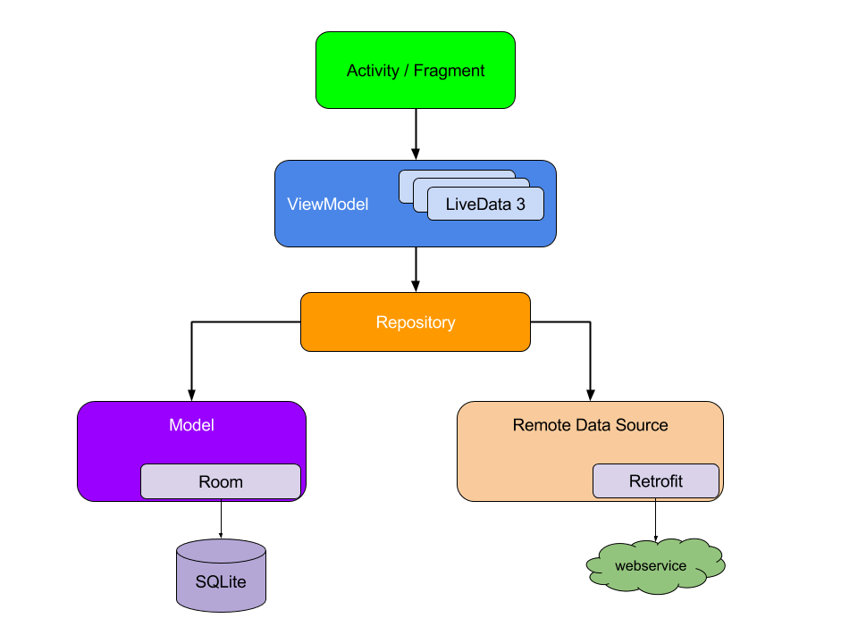

# MVVM Architecture For Android Development Short Note
MVVM stands for **Model**, **View**, **ViewModel**.

* ## **Model**: This is the data layer of the application. Data layer classes should not directly communicate with the View. Communications should happen through the ViewModels.
* 
* 
* 
* ## **View**: This is the presentation(User Interface) layer of the application . It observes(LiveData or Flow) the ViewModel. It should not hold any application logic related codes.
* 
* 
* 
* ## **ViewModel**: ViewModel means "a model for a view". Usually each activity has its own ViewModel. ViewModel acts as a link between the Model and the View(activity and fragments). It’s responsible for transforming the data from the Model and providing them to the View. It also send data(user inputs) from the view to the model. In some situations, It also uses callbacks to update the View.
* 
* 

This diagram(copied from google's official documentation) shows the architecture diagram we follow in Android MVVM projects.

What is the difference between **MVVM architecture** and **MVVM clean architecture**?

(You will experience  many MVVM Clean architecture project examples in other sections of this course)

In MVVM clean architecture, when required we add use case classes between the ViewModel and Repository. Also we define interfaces first and then create their implementation classes for many data layer components. MVVM clean architecture is just a more readable, expandable and testable improvement of MVVM architecture.

